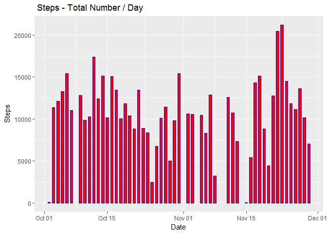
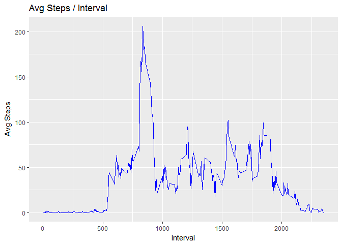
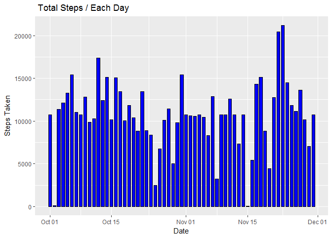
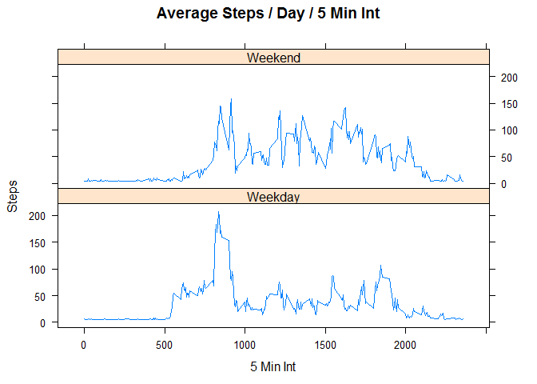

# Reproducible Research: Peer Assessment 1

## Activity Monitoring Data

## Loading and preprocessing the data

Downloading data from <https://d396qusza40orc.cloudfront.net/repdata%2Fdata%2Factivity.zip>


```r
download.file("https://d396qusza40orc.cloudfront.net/repdata%2Fdata%2Factivity.zip", destfile = "./repdata-data-activity.zip")
unzip("./repdata-data-activity.zip")
Rawdata <- read.csv("./activity.csv", colClasses=c("integer","Date","numeric"))
```


Next, looking at data structure


```r
str(Rawdata)
```

```
## 'data.frame':	17568 obs. of  3 variables:
##  $ steps   : int  NA NA NA NA NA NA NA NA NA NA ...
##  $ date    : Date, format: "2012-10-01" "2012-10-01" ...
##  $ interval: num  0 5 10 15 20 25 30 35 40 45 ...
```

Loading dplyr and ggplot2 

```r
library(dplyr)
```

```
## 
## Attaching package: 'dplyr'
```

```
## The following objects are masked from 'package:stats':
## 
##     filter, lag
```

```
## The following objects are masked from 'package:base':
## 
##     intersect, setdiff, setequal, union
```

```r
library(lattice)
library(ggplot2)
```

Calculate the total number of steps taken per day


```r
dayTot <- Rawdata %>% 
     group_by(date) %>% 
     summarize(DaySteps = sum(steps)) %>% 
     na.omit()
```

Making a histogram of the total number of steps taken each day


```r
ggplot(dayTot, aes(date, DaySteps)) + geom_bar(stat = "identity", colour = "blue", fill = "red", width = 0.6)  + labs(title = " Steps - Total Number / Day", x = "Date", y = "Steps")
```

<!-- -->

Calculate and report the mean and median of the total number of steps taken per day

```r
MeanMedian <- dayTot %>% summarize(mean   = mean(DaySteps), median = median(DaySteps))
print(MeanMedian)
```

```
## # A tibble: 1 x 2
##       mean median
##      <dbl>  <int>
## 1 10766.19  10765
```

What is the average daily activity pattern?
Make a time series plot (i.e. type = "l") of the 5-minute interval (x-axis) and the average number of steps taken, averaged across all days (y-axis).


```r
dataAvg <- Rawdata[complete.cases(Rawdata),]
AvgSteps <- group_by(dataAvg, interval)
AverageSteps <- summarise(AvgSteps, avg = mean(steps))
ggplot(AverageSteps, aes(interval, avg)) + geom_line(colour = "blue")  + labs(title = "Avg Steps / Interval", x = "Interval", y = "Avg Steps")
```

<!-- -->

```r
AverageSteps [which.max(AverageSteps$avg),]
```

```
## # A tibble: 1 x 2
##   interval      avg
##      <dbl>    <dbl>
## 1      835 206.1698
```

Imputing missing values
Calculate and report the total number of missing values in the dataset (i.e. the total number of rows with NAs)


```r
sum(is.na(Rawdata))
```

```
## [1] 2304
```

Devise a strategy for filling in all of the missing values in the dataset. I will use the mean values to fill NAs.
Create a new dataset that is equal to the original dataset but with the missing data filled in.


```r
Rawdata$steps[is.na(Rawdata$steps)] <- mean(Rawdata$steps, na.rm = TRUE)
```

Verify that are no missing values


```r
sum(is.na(Rawdata$steps))
```

```
## [1] 0
```

Make a histogram of the total number of steps taken each day and Calculate and report the mean and median total number of steps taken per day


```r
TotalSteps <- group_by(Rawdata, date)
XSteps <- summarise(TotalSteps, total = sum(steps))
ggplot(XSteps, aes(date, total)) + geom_bar(stat = "identity", colour = "black", fill = "blue", width = 0.7)  + labs(title = " Total Steps / Each Day", x = "Date", y = "Steps Taken")
```

<!-- -->

Calculate the mean and median


```r
mean(AvgSteps$steps)
```

```
## [1] 37.3826
```

```r
median(AvgSteps$steps)
```

```
## [1] 0
```

There are differences. Imputing NAs modifies the median and mean values.

Making a panel plot containing a time series plot of the 5-minute interval (x-axis) and the average number of steps taken, averaged across all weekday days or weekend days (y-axis)


```r
weekdays <- c("Monday", "Tuesday", "Wednesday", "Thursday", "Friday")
Rawdata$date = as.factor(ifelse(is.element(weekdays(as.Date(Rawdata$date)),weekdays), "Weekday", "Weekend"))
steps05 <- aggregate(steps ~ interval + date, Rawdata, mean)
xyplot(steps05$steps ~ steps05$interval|steps05$date, main="Average Steps / Day / 5 Min Int",xlab="5 Min Int", ylab="Steps",layout=c(1,2), type="l")
```

<!-- -->

